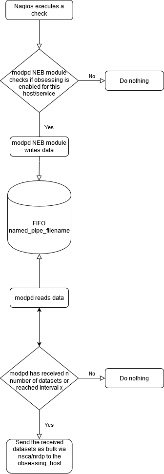

[](https://travis-ci.org/ccztux/modpd)
[](https://travis-ci.org/ccztux/modpd)
[](https://github.com/ccztux/modpd/releases/latest)
[](https://github.com/ccztux/modpd/milestones)
[](https://github.com/ccztux/modpd/issues)
[](https://github.com/ccztux/modpd/blob/master/LICENSE)


# Table of contents
* [What is modpd?](#what-is-modpd)
* [Known Issues](#known-issues)
* [Flowchart](#flowchart)
* [Registered trademarks](#registered-trademarks)
* [Required binaries](#required-binaries)
   * [Required binaries to install modpd](#required-binaries-to-install-modpd)
   * [Required by the daemon part of modpd](#required-by-the-daemon-part-of-modpd)
   * [Optionally used binaries which depends on configured features](#optionally-used-binaries-which-depends-on-configured-features)
   * [Required for building, compiling and installing the modpd NEB module](#required-for-building-compiling-and-installing-the-modpd-neb-module)
* [Installation](#installation)
   * [Installation on the Nagios® site with active checks](#installation-on-the-nagios-site-with-active-checks)
      * [Download the latest sources of modpd](#download-the-latest-sources-of-modpd)
      * [Installation of the modpd NEB module part](#installation-of-the-modpd-neb-module-part)
      * [Installation of the modpd daemon part](#installation-of-the-modpd-daemon-part)
      * [Installation of the clients (of your choice)](#installation-of-the-clients-of-your-choice)
         * [send_nrdp.php](#send_nrdpphp)
         * [send_nsca](#send_nsca)
   * [Installation on the Nagios® site with passive checks](#installation-on-the-nagios-site-with-passive-checks)
      * [Installation of the server software (of your choice)](#installation-of-the-server-software-of-your-choice)
         * [NRDP](#nrdp)
         * [NSCA](#nsca)
* [Updating modpd](#updating-modpd)
   * [Make a backup](#make-a-backup)
   * [Download the latest sources of modpd](#download-the-latest-sources-of-modpd-1)
   * [Updating the modpd NEB module](#updating-the-modpd-neb-module)
   * [Updating the modpd daemon](#updating-the-modpd-daemon)
* [File overview](#file-overview)
* [Backup your modpd installation](#backup-your-modpd-installation)
* [Daemon help output](#daemon-help-output)
* [Default sample config](#default-sample-config)
* [Example log snippets](#example-log-snippets)
   * [modpd daemon log snippet](#modpd-daemon-log-snippet)
   * [modpd NEB module log snippet](#modpd-neb-module-log-snippet)


# What is modpd?
(**M**onitoring **O**bsessing **D**ata **P**rocessor **D**aemon)

modpd consists of a NEB module and a daemon written in bash. The NEB module collects data and writes
it to a named pipe. The daemon part reads the data from the named pipe and sends the check results
via NRDP or NSCA to another Nagios® server. It increases the performance of an existing Nagios® 3.x.x
installation greatly, because the obsessing commands will be executed by modpd and not by the Nagios®
process itself. Nagios® executes the obsessing command after every check, where obsessing is activated
and then Nagios® waits, till every obsessing command was executed successfully or timed out.


# Known Issues
* [Reloading modpd is causing one invalid dataset #118](https://github.com/ccztux/modpd/issues/118)
If the daemon will be reloaded, one dataset is getting malformed and will be detected as an invalid dataset.
Nevertheless you should prefere the reload function over the restart function if you have only changed
something in the configuration, because in case of a restart more than one datasets are getting lost.


# Flowchart



# Registered trademarks
[Nagios®](https://www.nagios.org/) is a registered trademark


# Required binaries
## Required binaries to install modpd
- **wget** to download the latest release of modpd
- **tar** to untar the downloaded package of modpd
- **cp** to copy the files
- **chown** to change the ownership of files
- **chmod** to change the permission of files


## Required by the daemon part of modpd
- **bash** (version >= 3)
- **whoami** to check the user who has started modpd
- **pgrep** to check if an instance of modpd is already running
- **date** for logging purposes (Only required if bash version < 4.2, else bash's printf builtin will be used.)
- **rm** to delete the named_pipe_filename
- **mkdir** to create directories
- **mkfifo** to create the named_pipe_filename
- **kill** to send signals to modpd
- **sleep** to do nothing :)
- **logrotate** to rotate modpd's logfile


## Optionally used binaries which depends on configured features
- **logger** to log to the system log
- **systemd-cat** to log to the system journal
- **timeout** to start the obsessing jobs with a timeout value
- **php** in case obsessing_interface is nrdp


## Required for building, compiling and installing the modpd NEB module
- **make** to build the modpd NEB module
- **gcc** to compile the modpd NEB module
- **install** to install the modpd NEB module
- **strip** to strip the modpd NEB binary


# Installation
## Installation on the Nagios® site with active checks
### Download the latest sources of modpd
Download the latest tarball and extract it:
```bash
cd /tmp
wget "https://api.github.com/repos/ccztux/modpd/tarball" -O modpd.latest.tar.gz
tar -xvzf modpd.latest.tar.gz
cd ccztux-modpd-*
```


### Installation of the modpd NEB module part
Build the modpd NEB module:
```bash
make
make install
```


Add the modpd NEB module with the editor of your choice to your main Nagios® config file:

(Default Nagios® main config file: ```/usr/local/nagios/etc/nagios.cfg```)
```bash
broker_module=/usr/local/nagios/include/modpd.o
```


Set the eventbroker options with the editor of your choice in your main nagios config file:

(Default Nagios® main config file: ```/usr/local/nagios/etc/nagios.cfg```)
```bash
event_broker_options=-1
```


Restart nagios:
```bash
service nagios restart
```


Check if nagios is running:
```bash
service nagios status
```


Check if the modpd NEB module was loaded by Nagios®:
```bash
[root@lab01]:~# grep -i modpd /usr/local/nagios/var/nagios.log
[1582272717] modpd: Copyright © 2017-2020 Christian Zettel (ccztux), all rights reserved, Version: 2.3.0
[1582272717] modpd: Starting...
[1582272717] Event broker module '/usr/local/nagios/include/modpd.o' initialized successfully.
```


### Installation of the modpd daemon part
Copy the files:
```bash
cp -av ./usr/local/modpd/ /usr/local/
cp -av ./etc/* /etc/
```


Change the file ownerships:
```bash
chown -R nagios:nagios /usr/local/modpd/
chown root:root /etc/logrotate.d/modpd
chmod 644 /etc/logrotate.d/modpd
chown root:root /etc/init.d/modpd
chmod 755 /etc/init.d/modpd
chown root:root /etc/sysconfig/modpd
chmod 644 /etc/sysconfig/modpd
```


Copy the sample modpd daemon config file:
```bash
cp -av /usr/local/modpd/etc/modpd.sample.conf /usr/local/modpd/etc/modpd.conf
```


Edit the modpd daemon config to meet your requirements:
```bash
vim /usr/local/modpd/etc/modpd.conf
```


Start the modpd daemon:
```bash
service modpd start
```


Check if the modpd daemon is running:
```bash
service modpd status
tail -f /usr/local/modpd/var/log/modpd.log
```


Enable the modpd daemon at system boot:
```bash
chkconfig --add modpd
chkconfig modpd on
```


Check for which runlevels modpd is activated:
```bash
chkconfig --list modpd
```


### Installation of the clients (of your choice)
#### send_nrdp.php

[Official NRDP Documentation by Nagios®](https://github.com/NagiosEnterprises/nrdp)

Download the latest tarball and extract it:
```bash
cd /tmp
wget "https://api.github.com/repos/NagiosEnterprises/nrdp/tarball" -O nrdp.latest.tar.gz
tar -xvzf nrdp.latest.tar.gz
cd NagiosEnterprises-nrdp-*
```


Copy the send_nrdp.php script:
```bash
cp -av ./clients/send_nrdp.php /usr/local/modpd/libexec/
```


Change the file ownership:
```bash
chown nagios:nagios /usr/local/modpd/libexec/send_nrdp.php
```


#### send_nsca

[Official NSCA Documentation by Nagios®](https://github.com/NagiosEnterprises/nsca)

Download the latest tarball and extract it:
```bash
cd /tmp
wget "https://api.github.com/repos/NagiosEnterprises/nsca/tarball" -O nsca.latest.tar.gz
tar -xvzf nsca.latest.tar.gz
cd NagiosEnterprises-nsca-*
```


Build and compile the send_nsca binary:
```bash
./configure
make send_nsca
```


Copy the files:
```bash
cp -av ./src/send_nsca /usr/local/modpd/libexec/send_nsca
cp -av ./sample-config/send_nsca.cfg /usr/local/nagios/etc/
```


Change the file ownerships:
```bash
chown nagios:nagios /usr/local/modpd/libexec/send_nsca
chown nagios:nagios /usr/local/nagios/etc/send_nsca.cfg
```


Edit the send_nsca config to meet your requirements:
```bash
vim /usr/local/nagios/etc/send_nsca.cfg
```


## Installation on the Nagios® site with passive checks
### Installation of the server software (of your choice)
#### NRDP

[Official NRDP Documentation by Nagios®](https://github.com/NagiosEnterprises/nrdp)


#### NSCA

[Official NSCA Documentation by Nagios®](https://github.com/NagiosEnterprises/nsca)


# Updating modpd
## Make a backup
Make a backup of your existing installation as described [here](https://github.com/ccztux/modpd#backup-your-modpd-installation)


## Download the latest sources of modpd
Download the latest tarball and extract it:
```bash
cd /tmp
wget "https://api.github.com/repos/ccztux/modpd/tarball" -O modpd.latest.tar.gz
tar -xvzf modpd.latest.tar.gz
cd ccztux-modpd-*
```


## Updating the modpd NEB module
Build the modpd NEB module:
```bash
make
make install
```


Restart nagios:
```bash
service nagios restart
```


Check if nagios is running:
```bash
service nagios status
```


Check if the modpd NEB module was loaded by Nagios®:
```bash
[root@lab01]:~# grep -i modpd /usr/local/nagios/var/nagios.log
[1582272717] modpd: Copyright © 2017-2020 Christian Zettel (ccztux), all rights reserved, Version: 2.3.0
[1582272717] modpd: Starting...
[1582272717] Event broker module '/usr/local/nagios/include/modpd.o' initialized successfully.
```


## Updating the modpd daemon
Copy the files:
```bash
cp -av ./usr/local/modpd/ /usr/local/
cp -av ./etc/* /etc/
```


Change the file ownerships:
```bash
chown -R nagios:nagios /usr/local/modpd/
chown root:root /etc/logrotate.d/modpd
chmod 644 /etc/logrotate.d/modpd
chown root:root /etc/init.d/modpd
chmod 755 /etc/init.d/modpd
chown root:root /etc/sysconfig/modpd
chmod 644 /etc/sysconfig/modpd
```


Merge possible changes between the new sample config and your productive one using the tool of your choice like vimdiff:
```bash
vimdiff ./usr/local/modpd/etc/modpd.sample.conf /usr/local/modpd/etc/modpd.conf
```


Restart the modpd daemon:
```bash
service modpd restart
```


Check if the modpd daemon is running:
```bash
service modpd status
tail -f /usr/local/modpd/var/log/modpd.log
```


# File overview
- ```/etc/init.d/modpd``` init script for the modpd daemon
- ```/etc/logrotate.d/modpd``` logrotate config file for the modpd daemon logfile
- ```/etc/sysconfig/modpd``` default configuration values for the modpd init script
- ```/usr/local/modpd/bin/modpd``` modpd daemon
- ```/usr/local/modpd/etc/modpd.conf``` configuration file for the modpd daemon
- ```/usr/local/modpd/var/log/modpd.log``` modpd daemon logfile (will be created by the daemon)
- ```/usr/local/modpd/var/log/modpd.monitoring.debug.log``` debug logfile containing raw monitoring data (will be created by the daemon)
- ```/usr/local/modpd/var/log/modpd.obsessing.debug.log``` debug logfile containing processed obsessing data (will be created by the daemon)
- ```/usr/local/modpd/var/lock/modpd.lock``` modpd daemon lockfile (will be created by the daemon)
- ```/usr/local/modpd/var/rw/modpd.cmd``` named pipe (will be created by the daemon)
- ```/usr/local/nagios/include/modpd.o``` modpd NEB module


# Backup your modpd installation
Make a backup of your existing installation:
```bash
tar -cvzf modpd.bak_$(date +%s).tar.gz /etc/init.d/modpd \
                                       /etc/logrotate.d/modpd \
                                       /etc/sysconfig/modpd \
                                       /usr/local/modpd/ \
                                       /usr/local/nagios/include/modpd.o
```


# Daemon help output
```
Usage: modpd OPTIONS

Author:                 Christian Zettel (ccztux)
Last modification:      2020-12-13
Version:                2.3.0

Description:            modpd (Monitoring Obsessing Data Processor Daemon)

OPTIONS:
   -h           Shows this help.
   -c           Path to config file. (Default: /usr/local/modpd/etc/modpd.conf)
   -e           Error mode. Log bash errors additionally to: /usr/local/modpd/var/log/modpd.log
                WARNING: This is not intended for use in a production environment!
   -v           Shows detailed version information.
```


# Default sample config
```bash
#!/usr/bin/env bash

#========================================================================================================
#
#  Author:				Christian Zettel (ccztux)
#						2017-05-14
#						http://linuxinside.at
#
#  Copyright:			Copyright © 2017-2020 Christian Zettel (ccztux), all rights reserved
#
#  Project website:		https://github.com/ccztux/modpd
#
#  Last Modification:	Christian Zettel (ccztux)
#						2020-12-13
#
#  Version				2.3.0
#
#  Description:			Config file for modpd (Monitoring Obsessing Data Processor Daemon)
#
#  License:				GNU GPLv2
#
#  This program is free software; you can redistribute it and/or modify
#  it under the terms of the GNU General Public License as published by
#  the Free Software Foundation; either version 2 of the License, or
#  (at your option) any later version.
#
#  This program is distributed in the hope that it will be useful,
#  but WITHOUT ANY WARRANTY; without even the implied warranty of
#  MERCHANTABILITY or FITNESS FOR A PARTICULAR PURPOSE.  See the
#  GNU General Public License for more details.
#
#  You should have received a copy of the GNU General Public License along
#  with this program; if not, write to the Free Software Foundation, Inc.,
#  51 Franklin Street, Fifth Floor, Boston, MA 02110-1301 USA.
#
#========================================================================================================

# shellcheck disable=SC2034
# shellcheck disable=SC2154


#---------------------------------------------------
# In case of direct execution, write output and exit
#---------------------------------------------------

if [ "${BASH_SOURCE[0]}" == "${0}" ]
then
	printf "\\n%s is a bash config file. Dont execute it directly!\\n\\n" "${0##*/}"
	exit 1
fi


#==========================================================
#
# Modify the following parameters to meet your requirements
#
#==========================================================

#-------------------
# Obsessing settings
#-------------------

# define the obsessing interface
# (valid values: nrdp|nsca)
obsessing_interface="nrdp"

# define the host, where check results should be sent to
obsessing_host="10.0.0.31"

# define the port, where the obsessing daemon is listening on
obsessing_port="443"

# define the separator which should be used
obsessing_data_separator="\\x1e"


#--------------------------------------------------------------------
# NRDP specific settings (Needed in case obsessing_interface is nrdp)
#--------------------------------------------------------------------

# define the connection protocol
# (valid values: http|https)
nrdp_protocol="https"

# define the url path of the nrdp server
nrdp_url_path="/nrdp"

# define the nrdp token
nrdp_token="12345678"

# define the username, if nrdp basic auth is activated
nrdp_username="nrdpuser"

# define the password of the user you have defined in variable: nrdp_username with which we sould connect
nrdp_password="mySecret"


#--------------------------------------------------------------------
# NSCA specific settings (Needed in case obsessing_interface is nsca)
#--------------------------------------------------------------------

# define the path to the config file of send_nsca binary
nsca_config_file="/usr/local/nagios/etc/send_nsca.cfg"


#---------------------------------------------------------------------------------------
# Proxy settings (Needed in case obsessing_interface is nrdp and a proxy should be used)
#---------------------------------------------------------------------------------------

# enable proxy
proxy_enabled="0"

# username to authenticate on proxy server
proxy_username="ccztux"

# password to authenticate on proxy server
proxy_password="mySecret"

# proxy protocol
# (valid values: http|https)
proxy_protocol="https"

# proxy ip or hostname
proxy_ip="10.0.0.10"

# proxy port
proxy_port="3128"


#================================================================
#
# ONLY MODIFY THE FOLLOWING PARAMETERS, IF YOU KNOW, WHAT YOU DO!
#
#================================================================

#--------
# Logging
#--------

# enable log to file
# (valid values: 1|0)
log_to_file="1"

# enable log to stdout"
# (valid values: 1|0)
log_to_stdout="0"

# enable log to system logfile
# (valid values: 1|0)
log_to_syslog="0"

# enable log to system journal
# (valid values: 1|0)
log_to_journal="0"

# timestamp format for log messages
# (HINT: have a look at: 'man strftime')
log_timestamp_format="%Y-%m-%d %H:%M:%S"

# log invalid data
# (valid values: 1|0)
log_invalid_data="1"


#----------
# Debugging
#----------

# enable debug log of the raw data processed via obsessing_interface
# (valid values: 1|0)
debug_log_obsessing_data="0"

# enable debug log of the raw monitoring data submitted to the named pipe
# (valid values: 1|0)
debug_log_monitoring_data="0"

# time in seconds when the debug logfile should be truncated
debug_log_truncate_interval="604800"


#-------------
# Job settings
#-------------

# enable job timeout
job_timeout_enabled="1"

# job timeout in seconds (recommended: job_exec_interval * 2)
job_timeout="8"

# job execution interval in seconds
job_exec_interval="4"

# job max bulk size
job_max_bulk_size="50"

# log unsuccessful job commands
# (valid values: 1|0)
job_command_log_nok="1"

# log timed out job commands
# (valid values: 1|0)
job_command_log_timeout="1"

# log successful job commands
# (valid values: 1|0)
job_command_log_ok="0"


#------
# Stats
#------

# enable stats logging
stats_enabled="1"

# interval in seconds when the stats should be logged
stats_interval="300"
```


# Example log snippets
## modpd daemon log snippet
```
[root@lab01]:~# service modpd status
modpd (PID 6931) is running                                [  OK  ]

[root@lab01]:~# service modpd stop
Stopping modpd                                             [  OK  ]

[root@lab01]:~# grep 6931 /usr/local/modpd/var/log/modpd.log
2020-12-13 12:07:53 |   6931 |                     setLock | Script lock directory exists and permissions are ok
2020-12-13 12:07:53 |   6931 |                     setLock | Setting lock...
2020-12-13 12:07:53 |   6931 |                     setLock | Setting lock was successful
2020-12-13 12:07:53 |   6931 |              checkNamedPipe | Check if named pipe: '/usr/local/modpd/var/rw/modpd.cmd' exists and if it is read/writeable...
2020-12-13 12:07:53 |   6931 |              checkNamedPipe | Named pipe doesnt exist
2020-12-13 12:07:53 |   6931 |             createNamedPipe | Creating named pipe...
2020-12-13 12:07:53 |   6931 |             createNamedPipe | Creating named pipe was successful
2020-12-13 12:07:53 |   6931 |             buildJobCommand | Building job command...
2020-12-13 12:07:53 |   6931 |             buildJobCommand | We build the following job command: '/usr/bin/timeout --signal=TERM 8 /usr/bin/php /usr/local/modpd/libexec/send_nrdp.php --usestdin --delim="" --token="[HIDDEN FOR SECURITY]" --url=https://nrdpuser:[HIDDEN FOR SECURITY]@10.0.0.74:443/nrdp'
2020-12-13 12:07:53 |   6931 |                       _main | Ready to handle jobs...
2020-12-13 12:08:24 |   6931 |                    logStats | ---- Stats for the last 31 seconds ----
2020-12-13 12:08:24 |   6931 |                    logStats | modpd is running: 0d 0h 0m 31s
2020-12-13 12:08:24 |   6931 |                    logStats | Total processed jobs: '4', successful processed jobs: '4', unsuccessful processed jobs: '0', timed out jobs: '0'
2020-12-13 12:08:24 |   6931 |                    logStats | Handled host checks: '1011', handled service checks: '751', invalid datasets received: '0'
2020-12-13 12:08:54 |   6931 |                    logStats | ---- Stats for the last 30 seconds ----
2020-12-13 12:08:54 |   6931 |                    logStats | modpd is running: 0d 0h 1m 1s
2020-12-13 12:08:54 |   6931 |                    logStats | Total processed jobs: '5', successful processed jobs: '5', unsuccessful processed jobs: '0', timed out jobs: '0'
2020-12-13 12:08:54 |   6931 |                    logStats | Handled host checks: '1095', handled service checks: '751', invalid datasets received: '0'
2020-12-13 12:09:21 |   6931 |               signalHandler | Caught: 'SIGTERM', preparing for shutdown...
2020-12-13 12:09:21 |   6931 |                    logStats | ---- Stats for the last 27 seconds ----
2020-12-13 12:09:21 |   6931 |                    logStats | modpd is running: 0d 0h 1m 28s
2020-12-13 12:09:21 |   6931 |                    logStats | Total processed jobs: '5', successful processed jobs: '5', unsuccessful processed jobs: '0', timed out jobs: '0'
2020-12-13 12:09:21 |   6931 |                    logStats | Handled host checks: '1018', handled service checks: '749', invalid datasets received: '0'
2020-12-13 12:09:21 |   6931 |               signalHandler | Caught: 'EXIT', shutting down...
2020-12-13 12:09:21 |   6931 |              checkNamedPipe | Check if named pipe: '/usr/local/modpd/var/rw/modpd.cmd' exists and if it is read/writeable...
2020-12-13 12:09:22 |   6931 |              checkNamedPipe | Named pipe exists and it is read/writeable
2020-12-13 12:09:22 |   6931 |             removeNamedPipe | Remove named pipe...
2020-12-13 12:09:22 |   6931 |             removeNamedPipe | Removing named pipe was successful
2020-12-13 12:09:22 |   6931 |                   checkLock | Check if lock file: '/usr/local/modpd/var/lock/modpd.lock' exists and if it is read and writeable...
2020-12-13 12:09:22 |   6931 |                   checkLock | Lock file exists and it is read/writeable
2020-12-13 12:09:22 |   6931 |                  removeLock | Removing lock...
2020-12-13 12:09:22 |   6931 |                  removeLock | Removing lock was successful
2020-12-13 12:09:22 |   6931 |               signalHandler | Exitcode: '143'
2020-12-13 12:09:22 |   6931 |               signalHandler | modpd was running: 0d 0h 1m 29s
2020-12-13 12:09:22 |   6931 |               signalHandler | Bye, bye...
```


## modpd NEB module log snippet
```
[root@lab01]:~# grep -i modpd /usr/local/nagios/var/nagios.log
[1607079032] modpd: Copyright © 2017-2020 Christian Zettel (ccztux), all rights reserved, Version: 2.3.0
[1607079032] modpd: Starting...
[1607079032] Event broker module '/usr/local/nagios/include/modpd.o' initialized successfully.
[1607079332] modpd: The modpd NEB module is running 0d 0h 5m 0s
[1607079332] modpd: *** Stats of processed checks for the last 300 seconds: Hosts: 9234 (OK: 8959/NOK: 275), Services: 5927 (OK: 5927/NOK: 0) ***
[1607079632] modpd: The modpd NEB module is running 0d 0h 10m 0s
[1607079632] modpd: *** Stats of processed checks for the last 300 seconds: Hosts: 9753 (OK: 6729/NOK: 3024), Services: 7502 (OK: 5177/NOK: 2325) ***
[1607079932] modpd: The modpd NEB module is running 0d 0h 15m 0s
[1607079932] modpd: *** Stats of processed checks for the last 300 seconds: Hosts: 9779 (OK: 0/NOK: 9779), Services: 7503 (OK: 0/NOK: 7503) ***
```
